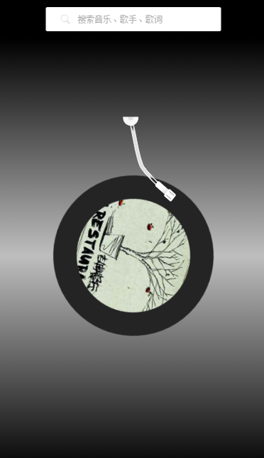

# vue2-music
> vue2.0 + vue-router + vuex + vue-resource （全家桶）+ qq音乐api + 网易云音乐风格UI（= =）

## install and build

``` 
# install
npm install

# serve at localhost:8080
npm run dev

# build
npm run build
```
### 目前功能
* 歌曲搜索
* 歌曲播放、暂停（带动画）

### 待实现
* 上一曲、下一曲
* 歌词展示
* 各种列表

#### 播放界面
